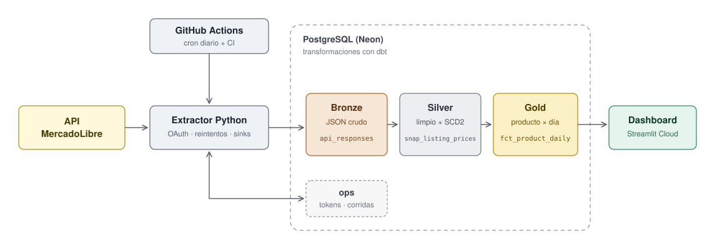

# MeLi Price Tracker

Pipeline de datos que sigue a diario el precio de productos de MercadoLibre, guarda el **historial completo de precios (SCD tipo 2)** y muestra qué productos bajaron o subieron, cuántos vendedores compiten por cada uno y cuándo un precio está por debajo de lo habitual.

Cubre el caso más común en data engineering: **ingesta robusta de una API externa**, carga incremental, historización de cambios y automatización sin servidor propio.

> **Estado:** Fases 0 a 3 completadas: extracción a bronze en PostgreSQL (Neon) y modelos silver/gold con dbt · Fase 4 (orquestación) próxima

---

## Resultado

- **Historial diario de precios** de cada vendedor para los productos de una watchlist configurable
- **Historial de cambios (SCD2)**: cada cambio de precio, descuento o condición de envío queda registrado con su vigencia
- **Competencia por producto**: precio mínimo, mediana y cantidad de vendedores por día
- **Mayores bajas y subas de la semana**
- **Dashboard público** con ranking de movimientos, evolución de precio por producto y salud del pipeline
- **Ejecución diaria automática** con GitHub Actions, idempotente y con costo $0

---

## Arquitectura



1. **GitHub Actions** dispara el pipeline una vez por día.
2. El **extractor Python** se autentica con OAuth, consulta la API con reintentos y guarda las respuestas sin modificar.
3. **dbt** transforma los datos en tres capas dentro de PostgreSQL.
4. El **dashboard** lee la capa gold.

### Cómo se obtienen los datos

Desde 2025, MercadoLibre restringe varios endpoints a aplicaciones certificadas: la búsqueda general de publicaciones, los más vendidos y el detalle de publicaciones de terceros devuelven 403. La Fase 0 validó un camino que sí está disponible, basado en el **catálogo de productos**:

| Paso | Endpoint | Frecuencia |
|---|---|---|
| Descubrimiento | `/products/search` filtrado por búsqueda y dominio | Semanal |
| Precios | `/products/{id}/items`: todos los vendedores de un producto (hasta 100 por llamada) | Diaria |
| Atributos | `/products/{id}`: nombre y características del producto | Al descubrirlo |

El producto de catálogo es una entidad estable (por ejemplo, "iPhone 15 128 GB Negro"), y sus publicaciones son los vendedores que compiten por él. Eso permite analizar precios por producto y no por publicación individual.

### Capas (arquitectura medallion)

| Capa | Contenido | Tablas principales |
|---|---|---|
| **Bronze** | Respuestas de la API tal cual llegan, en `jsonb` | `api_responses` |
| **Silver** | Datos tipados y deduplicados, con historial SCD2 | `stg_products`, `stg_listing_prices`, `scd_listing_prices` |
| **Gold** | Modelo estrella listo para consumir | `dim_product`, `dim_seller`, `fct_listing_daily`, `fct_product_daily`, `mart_weekly_movers` |

El schema `ops` queda fuera de las capas: guarda el estado operativo del pipeline (tokens y registro de corridas), no datos de negocio.

---

## Patrones de diseño

### 1. Medallion (arquitectura de datos)
Separar crudo, limpio y consumible permite reprocesar sin volver a consultar la API y deja claro qué capa usa cada consumidor.

### 2. Sinks intercambiables (código)
El extractor no sabe dónde se guardan los datos: escribe a través de una interfaz `Sink` con un único método, `write_batch(records, run_id)`.

```python
class Sink(Protocol):
    def write_batch(self, records: list[dict], run_id: str) -> None: ...

class PostgresSink:   # escribe en bronze.api_responses
    ...
```

Cambiar el destino (por ejemplo, a un data lake) es agregar un sink nuevo y cambiar una línea de configuración, sin tocar el cliente de la API ni la lógica de extracción.

### 3. Modelo estrella en gold (modelado)
Gold sigue un modelo dimensional estilo Kimball, con dos tablas de hechos de distinto grano:

- **`dim_product`**: producto de catálogo, nombre, dominio y atributos
- **`dim_seller`**: vendedor, provincia, si es tienda oficial
- **`fct_listing_daily`**: publicación × día, con precio, precio original, envío y condición
- **`fct_product_daily`**: producto × día, con precio mínimo, mediana, cantidad de vendedores y brecha entre el más barato y el segundo

`mart_weekly_movers` se arma encima de `fct_product_daily`.

---

## Decisiones de diseño

| Decisión | Por qué |
|---|---|
| **Descubrimiento por catálogo** | Es el camino disponible para apps no certificadas, y el producto de catálogo es mejor unidad de análisis que la publicación suelta. |
| **Watchlist en `watchlist.toml`** | Cada entrada es una búsqueda con su dominio y un máximo de productos. TOML se lee con la biblioteca estándar (`tomllib`), sin dependencias extra. |
| **Filtro por regex sobre modelo y nombre** | La búsqueda del catálogo es aproximada y el atributo `MODEL` lo cargan los vendedores sin formato fijo (el mismo Galaxy S24 aparece como "S24", "Galaxy S24" o "S24 (eSIM)"). Un valor exacto pierde productos; las regex `include`/`exclude` de la watchlist los capturan y descartan variantes (FE, Ultra, Plus) antes de gastar llamadas en ellas. |
| **Descubrimiento semanal** | La lista de productos se guarda y se refresca cada 7 días o cuando cambia la watchlist. Los precios ya consultados al validar productos se reusan, sin repetir llamadas. |
| **ELT con capa bronze** | La respuesta JSON se guarda sin tocar. Si cambia la lógica, se reprocesa sin volver a consultar la API. |
| **Silver incremental e idempotente** | `stg_listing_prices` reprocesa los últimos 3 días y reemplaza cada producto-día completo (`delete+insert`). Correr dbt dos veces da el mismo resultado. |
| **Refresh token persistido en la base** | MercadoLibre rota el refresh token en cada uso; un secret estático de GitHub no alcanza. |
| **Permisos mínimos** | La app solo tiene acceso de lectura: un token filtrado no permite modificar nada en la cuenta. |
| **SCD2 como modelo, no como `dbt snapshot`** | Bronze guarda la historia completa, así que el historial se reconstruye entero desde ahí con un *gaps and islands*: una versión nueva cuando cambia el precio, el precio original, el envío o el tipo de publicación, o cuando la publicación reaparece después de faltar. Un snapshot es estado acumulado que no se puede regenerar; este modelo es determinista y se testea con tests singulares (sin superposiciones, una versión vigente, cobertura de cada precio diario). |
| **Registro de corridas en `ops.pipeline_runs`** | La fila se inserta al empezar (`running`) y se actualiza al terminar: una corrida que se cae a la mitad también queda visible. Guarda duración, productos, errores y respuestas 429. |
| **Renovación del token bajo lock** | El refresh se hace con un advisory lock de Postgres. Si dos corridas renuevan a la vez, la segunda espera y reusa el token nuevo en lugar de invalidarlo. |
| **Bronze solo agrega filas** | Nunca se modifica ni se borra: si el pipeline corre dos veces el mismo día, silver se queda con la última corrida de cada día. |
| **Fecha de snapshot en hora de Argentina** | Una corrida a las 22 h cuenta para ese día, aunque en UTC ya sea el siguiente. |
| **Migraciones versionadas** | Archivos SQL numerados en `db/migrations/`, aplicados una sola vez y registrados en `ops.schema_migrations`. |

> **Sobre la escala:** el volumen es de miles de filas por día, así que PostgreSQL alcanza de sobra. El diseño por capas y los sinks intercambiables permiten migrar a un lakehouse si el volumen creciera (ver [Roadmap](#roadmap)).

> **Sobre la inflación:** los precios están en pesos argentinos, donde una suba puede reflejar solo inflación. El roadmap incluye una dimensión de cotización del dólar para mostrar también variaciones en USD.

---

## Modelo de datos

| Schema | Tabla | Grano | Descripción |
|---|---|---|---|
| `bronze` | `api_responses` | request | JSON crudo + `run_id`, `endpoint`, `product_id`, `fetched_at` |
| `silver` | `stg_products` | producto | Nombre, dominio y atributos del catálogo |
| `silver` | `stg_listing_prices` | publicación × día | Precio, precio original, condición, tipo de publicación, envío, vendedor |
| `silver` | `scd_listing_prices` | publicación × versión | SCD2 con `valid_from` / `valid_to` (exclusivo) e `is_current` |
| `gold` | `dim_product` | producto | Atributos descriptivos |
| `gold` | `dim_seller` | vendedor | Provincia, tienda oficial |
| `gold` | `fct_listing_daily` | publicación × día | Precio y condiciones de venta |
| `gold` | `fct_product_daily` | producto × día | Precio mínimo, mediana, vendedores, brecha de precios |
| `gold` | `mart_weekly_movers` | producto × semana | Mayores bajas y subas |
| `ops` | `auth_tokens` | 1 fila | Access y refresh token vigentes |
| `ops` | `tracked_products` | producto | Productos seguidos, resultado del último descubrimiento |
| `ops` | `pipeline_runs` | corrida | Métricas y estado de cada ejecución |

En dbt se mantiene la convención de carpetas (`models/staging` → `silver`, `models/marts` → `gold`); una macro hace que cada carpeta escriba exactamente en su schema.

---

## Plan de acción

### Fase 0: Validar la API ✅
- [x] App registrada en el DevCenter de MercadoLibre, con permisos de solo lectura
- [x] Flujo OAuth completo con refresh token
- [x] Endpoints validados: búsqueda general, más vendidos y detalle de publicaciones bloqueados; catálogo de productos disponible
- [x] Smoke test exitoso localmente y desde GitHub Actions

### Fase 1: Extractor ✅
- [x] `auth.py`: renovación automática y persistencia atómica del token rotativo, bootstrap con PKCE opcional
- [x] `client.py`: reintentos con backoff exponencial y jitter (429, 5xx, errores de red), `Retry-After`, renovación ante 401
- [x] `discovery.py`: productos con vendedores activos a partir de `watchlist.toml`, con búsqueda paginada
- [x] `prices.py`: publicaciones y precios de cada producto
- [x] `LocalJsonlSink`: bronze en archivos JSON Lines particionados por fecha, mientras no hay base
- [x] Filtro de productos por dominio y regex sobre modelo y nombre
- [x] 34 tests unitarios con la API simulada, sin acceso a red

### Fase 2: Carga a bronze ✅
- [x] Neon PostgreSQL (São Paulo) con schemas `bronze`, `silver`, `gold` y `ops`, mediante migraciones versionadas
- [x] `PostgresSink`: cada lote se inserta en una sola transacción
- [x] Tokens, productos seguidos y registro de corridas en `ops`, para que el pipeline no dependa de archivos locales
- [x] Renovación del token protegida contra corridas simultáneas
- [x] Tests unitarios de los stores y tests de integración contra Postgres (opcionales, con `TEST_DATABASE_URL`)

### Fase 3: Transformación con dbt ✅
- [x] Silver: `stg_products` (atributos del catálogo), `stg_listing_prices` (incremental e idempotente) y `scd_listing_prices` (SCD2 reconstruible desde bronze)
- [x] Gold: `dim_product`, `dim_seller`, `fct_listing_daily`, `fct_product_daily`, `mart_weekly_movers`
- [x] Tests de datos: `unique`, `not_null`, relaciones, valores aceptados, precios positivos y frescura de bronze
- [x] Tests singulares del SCD2: sin versiones superpuestas, una sola versión vigente, cada precio diario cubierto por una versión
- [x] `python -m transform`: corre dbt con la misma `DATABASE_URL` que el extractor

### Fase 4: Orquestación (1 día)
- [ ] `daily.yml`: extracción + `dbt build` con cron diario
- [ ] `ci.yml`: lint (ruff), tests de Python y `dbt build` contra una base de prueba en cada PR
- [ ] Alerta si la corrida diaria falla

### Fase 5: Dashboard (1–2 días)
- [ ] Ranking de bajas y subas
- [ ] Evolución de precio y competencia por producto
- [ ] Panel de salud del pipeline (desde `ops.pipeline_runs`)
- [ ] Deploy en Streamlit Community Cloud

### Fase 6: Documentación (½ día)
- [ ] Captura del dashboard y link público
- [ ] Ejemplo de filas SCD2 explicadas
- [ ] Sección "qué aprendí / qué haría distinto"

---

## Estructura del repo

```
├── extract/
│   ├── config.py        # configuración desde el entorno
│   ├── auth.py          # obtención y rotación de tokens
│   ├── client.py        # cliente HTTP de la API
│   ├── discovery.py     # productos a seguir según la watchlist
│   ├── prices.py        # publicaciones y precios por producto
│   ├── db.py            # conexión y migraciones
│   ├── runlog.py        # registro de corridas
│   ├── sinks/
│   │   ├── base.py      # interfaz Sink
│   │   ├── local.py     # bronze en JSON Lines (desarrollo)
│   │   └── postgres.py  # bronze en Postgres
│   └── main.py          # punto de entrada: python -m extract
├── db/migrations/       # SQL versionado
├── transform/           # python -m transform: corre dbt con DATABASE_URL
├── dbt/
│   ├── models/staging/  # → silver (incluye el SCD2)
│   ├── models/marts/    # → gold
│   ├── macros/          # schemas, atributos del catálogo, tests genéricos
│   └── tests/           # tests singulares del SCD2
├── app/                 # dashboard Streamlit
├── tests/
├── scripts/             # utilidades de la Fase 0
├── docs/                # diagramas
├── watchlist.toml
└── .github/workflows/
    ├── daily.yml
    └── ci.yml
```

## Cómo correrlo

Requiere Python 3.11 o superior.

```bash
python -m venv .venv && source .venv/bin/activate   # en Windows: .venv\Scripts\Activate.ps1
pip install -r requirements.txt
cp .env.example .env                                 # completar con la app del DevCenter y DATABASE_URL

python -m extract db-init            # crea las tablas en Postgres (si hay un token local, lo importa)
python -m extract bootstrap          # autorización inicial, una sola vez
python -m extract run                # descubrimiento (si toca) y precios del día
python -m transform build            # modelos silver y gold de dbt, con sus tests
python -m unittest discover -s tests -t .   # tests
```

Sin `DATABASE_URL`, el pipeline guarda todo en archivos dentro de `data/`: sirve para probar sin base.

## Stack

Python · requests · PostgreSQL (Neon) · dbt-core · Streamlit · GitHub Actions

---

## Roadmap

- **Variaciones en USD:** dimensión diaria de cotización del dólar para separar cambios reales de precio de la inflación.
- **Migración a lakehouse (Databricks):** un nuevo sink escribe el JSON en un Volume de Unity Catalog sin cambiar el extractor; las mismas capas pasan a tablas Delta (Auto Loader en bronze, AUTO CDC en silver). Cierra con una comparativa de complejidad, costo y cuándo conviene cada versión.

## Nota sobre la API

Este proyecto usa una aplicación registrada en el DevCenter de MercadoLibre, con permisos de solo lectura, y respeta los límites de consultas de la API.
